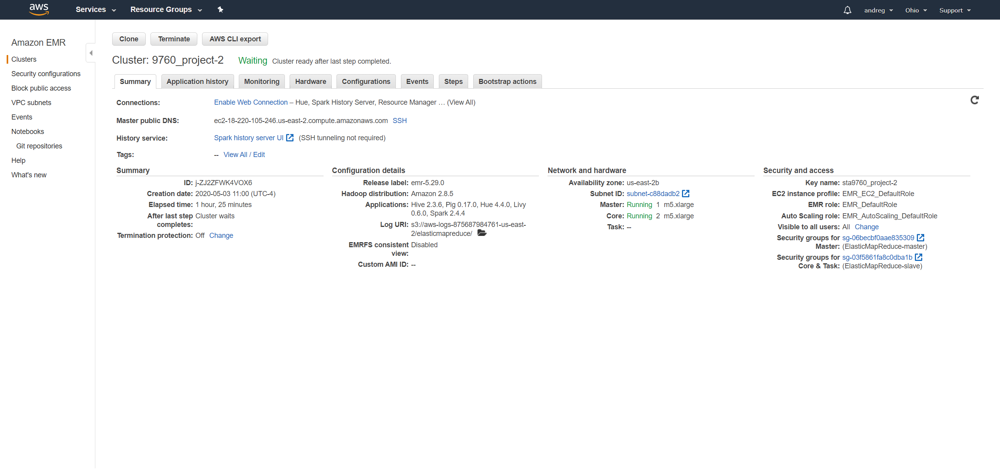

# Analyzing 10Gb of Yelp Reviews Data
We will analyze a subset of Yelp's business, reviews and user data. This dataset comes to us from Kaggle although we have taken steps to pull this data into a publis s3 bucket: #(user pays setting ON!)
s3://9760yelpdata/yelp_academic_dataset_business.json

# Cluster and Notebook Configs

